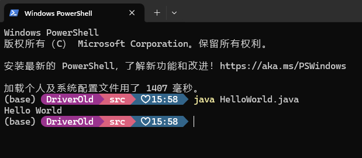

<div align="center">

# Java 第一次作业

</div>

## 题目

1. 下载安装 JDK8，并在自己电脑中配置 java 开发环境。安装 Idea IDE 开发工具，并在改工具上编译、运行 Application 程序。
2. 设 `byte b=127`，问表达式 `b+"+1="+(++b)`的运算结果是什么？为什么？
3. `int a[]=new int[5], b[]=a;` 执行语句 `b[0]=99;` 后，`a` 中各元素值为\_\_\_\_\_\_\_\_。

## 解答

1. Application 程序代码：

   ```java
   public class HelloWorld
   {
      public static void main(String[] args)
      {
         System.out.println("Hello World");
      }
   }
   ```

   运行结果：

   

2. **运算结果为 `128`**。表达式中，`b+"+1="`，会将 `b` 的值转换为字符串，然后连接 `"+1="`，结果为 `"127+1="`。`++b`将 `b` 的值加 1。所以，在 `++b` 操作之后整个表达式的结果是 `"127+1=128"`。
3. **`a` 中各元素值为 `[99, 0, 0, 0, 0]`**。`a` 和 `b` 引用了同一个数组。当执行语句 `b[0]=99;` 时，实际上修改了数组的第一个元素，这也会影响到 `a` 数组。所以，执行语句后 `a` 数组中各元素值为 `[99, 0, 0, 0, 0]`。
