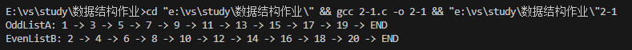

## 第一章

### 题目 1.1

一、在软件开发中，具备相同功能的软件，不同的实现往往具有性能上的不同。请从数据结构的角度分析该现象。

### 解答 1.1

数据结构是存储和组织数据的方式，不同的数据结构选择会直接影响到程序的性能，尤其在大规模数据处理或高并发环境下。根据所学知识，我将从四个方面来讲述一下不同的数据结构选择是如何影响到程序的性能的。

1. 数据的存储方式，数组和链表：数组适用于随机访问，但插入和删除操作可能比较慢。链表适用于频繁的插入和删除，但随机访问可能较慢。在需要频繁插入和删除的情况下，选择合适的存储方式可以提高软件的性能。

2. 数据的存储结构，顺序存储结构和链式存储结构：顺序存储的所有元素占用一整块内存空间，并且逻辑上相邻的元素物理上也相邻。但顺序存储对内存空位要求较高，如果内存中无法找到一块可以一次性存放完所有数据的内存空间，那么顺序存储就无法存储了。链式存储用指针表示逻辑关系，存放的是数据元素本身和与其逻辑上对于的相邻元素的地址。虽然链式存储所需存储空间较大但对单个内存空位要求不高，在内存足够的情况下可以存储更多数据。所有在在设计软件存储方面，要根据存储量的大小，选择合适的存储方式，从而也会影响到程序的性能。

3. 数据的逻辑结构，线性结构，非线性结构：不同的软件根据不同的需求要选取不同的数据结构来描述一个或者多个的问题。不同的逻辑结构对应计算机的处理速度也不同，从而影响到程序的性能。

4. 时间复杂度和空间复杂度：实现上面的数据结构的存储，逻辑，运算等等需要算法。但是不同的需求对应的算法是不同的，并且算法的复杂程度也是不同的。每个算法都有自己对应的时空复杂度，时空复杂度越高，处理越多的数据时，所耗费的时间更长。所有在软件开发过程中，要尽量选择时空复杂度较低的算法以优化软件速度。正是由于不同算法计算时长的不同，从而影响到程序的性能。

因此，我们在软件开发中，要根据具体的需求和场景，合理地选择和优化数据结构，以此来提高软件的性能表现。

## 第二章

### 题目 2.1

一、设计算法，将一个带头结点的单链表 A 分解为两个带头结点的单链表 A 和 B，使得 A 表中含有原表中序号为奇数的元素，而 B 表中含有原表中序号为偶数的元素，且保持其相对顺序不变。要求:

（1）给出算法的基本设计思想。可以选用下列方式的一种或多种进行表述：自然语言、流程图、伪代码等。
（2）根据设计思想，采用 C/C++语言实现，给出注释；并给出运行及结果截图。
（3）说明你所设计算法的时间复杂度和空间复杂度。
（4）请举例说明你所设计的算法在工程场景中的应用。

### 解答 2.1

**（1）基本设计思想**：

```shell
ADT 2.1 分解链表
ADT List
{
数据：
    多个元素组成的线性序列，数据元素之间的关系是一一对应关系。
设计思路：
    1. 初始化两个空链表A和B，分别表示奇数项和偶数项链表。
    2. 遍历原始链表的每个节点，根据节点的序号判断奇偶。
    3. 如果序号是奇数，将该节点插入链表A尾部；如果是偶数，将该节点插入链表B尾部。
    4. 最终得到奇数项链表A和偶数项链表B。
运算：
    List(L): 构造并初始化空线性表 L。
    splitLinkedList(L *head, A, B): 分解链表为一个奇数项链表A和偶数项链表B。head: 链表的头结点；A: 指向奇数项链表的头结点的指针；B: 指向偶数项链表的头结点的指针。
    printLinkedList(L):打印列表。遍历链表，输出每个节点的数据。
    main(): 主函数。创建一个链表并添加数据到链表中，调用splitLinkedList函数，将链表分解为奇数项链表和偶数项链表，分别打印奇数项链表和偶数项链表。
}
```

**（2）C 语言实现代码**：

```c
#include <stdio.h>
#include <stdlib.h>

// 初始化链表
struct List
{
    int data;
    struct List *next;
};

// 分解链表为一个奇数项链表A和偶数项链表B
void splitLinkedList(struct List *head, struct List **A, struct List **B)
{
    struct List *oddHead = NULL;  // 奇数序号链表的头结点
    struct List *evenHead = NULL; // 偶数序号链表的头结点
    struct List *current = head;  // 当前节点

    int index = 1; // 记录当前节点的序号

    while (current != NULL) // 当前节点不为空
    {
        struct List *newNode = (struct List *)malloc(sizeof(struct List));
        newNode->data = current->data;
        newNode->next = NULL;

        if (index % 2 == 1)
        { // 奇数序号节点
            if (oddHead == NULL)
            {
                // 链表为空，直接将新节点作为头节点
                oddHead = newNode;
                *A = oddHead;
            }
            else
            {
                // 将新节点作为头节点，并将头节点指向下一个节点
                oddHead->next = newNode;
                oddHead = oddHead->next;
            }
        }
        else
        { // 偶数序号节点
            if (evenHead == NULL)
            {
                // 链表为空，直接将新节点作为头节点
                evenHead = newNode;
                *B = evenHead;
            }
            else
            {
                // 将新节点作为头节点，并将头节点指向下一个节点
                evenHead->next = newNode;
                evenHead = evenHead->next;
            }
        }

        current = current->next;
        index++;
    }
}

// 打印链表
void printLinkedList(struct List *head)
{
    struct List *current = head;
    while (current != NULL)
    {
        printf("%d -> ", current->data);
        current = current->next;
    }
    printf("END\n");
}

int main()
{
    // 创建带头结点的原始链表
    struct List *head = (struct List *)malloc(sizeof(struct List));
    head->next = NULL;
    struct List *current = head;

    // 添加数据
    for (int i = 1; i <= 20; i++)
    {
        struct List *newNode = (struct List *)malloc(sizeof(struct List));
        newNode->data = i;
        newNode->next = NULL;
        current->next = newNode;
        current = current->next;
    }

    struct List *A = NULL; // 奇数项链表
    struct List *B = NULL; // 偶数项链表

    // 分解链表
    splitLinkedList(head->next, &A, &B);

    // 打印分解后的链表A和B
    printf("OddListA: ");
    printLinkedList(A);
    printf("EvenListB: ");
    printLinkedList(B);

    return 0;
}
```

**运行结果截图**：



**（3）时间复杂度和空间复杂度分析**：

- 时间复杂度：遍历原始链表时间复杂度为 $O(n)$，遍历过程中，每个节点执行一次提取并插入的操作，时间复杂度为 $O(1)$。总体时间复杂度为 $O(n)$。
- 空间复杂度：需要开辟额外的空间存储链表 A, B，空间复杂度为 $O(n)$。

**（4）工程场景中的应用**：
可以用于图像处理，对图像的像素进行处理。将图像的像素数据存储在一个单链表中，使用该算法将奇数行和偶数行（奇数列和偶数列）的像素提取出来，进行图像处理操作（例如图像的压缩等等）。

### 题目 2.2

二、设将$n(n>1)$个整数存放到一维数组 R 中，设计一个算法，将 R 中保存的序列循环左移$p(0<p<n)$个位置，即将 R 中的数据由$(r_{0},r_{1},...,r_{n-1})$变换为$(r_{p},r_{p+1},...,r_{n-1},r_{0},r_{1},...,r_{p-1})$。要求:

（1）给出算法的基本设计思想。可以选用下列方式的一种或多种进行表述：自然语言、流程图、伪代码等。
（2）根据设计思想，采用 C/C++语言实现，给出注释；并给出运行及结果截图。
（3）分析你所设计算法的时间复杂度和空间复杂度。
（4）请举例说明你所设计的算法在工程场景中的应用。

### 解答 2.2

**（1）基本设计思想**：

```shell
ADT 2.2 左移数组p个位置
ADT List
{
数据：
   int n: 数组元素个数
   int p: 要左移的位数
   int R[n]: 数组R
设计思路：
    1. 将整个数组 R 分为包含前 p 个元素的部分和包含剩余的元素的部分，共两个部分。
    2. 分别反转前半部分和后半部分
    3. 将整个数组 R 进行反转。
运算：
    reverse(arr[], start, end): 反转数组中的一段区间。start为开始反转的位置，end为结束反转的位置。
    Left(arr[], n, p): 将数组R中的数据左移p个位置。n为数组R的元素个数，p为要左移的位数。
    main(): 主函数。输入数组元素和左移的位数，输出左移后的数组。
}
```

**(2) C 语言实现代码**：

```c
#include <stdio.h>

// 反转数组中的一段区间
void reverse(int arr[], int start, int end)
{
    // 将数组中的元素反转
    while (start < end)
    {
        int temp = arr[start];
        arr[start] = arr[end];
        arr[end] = temp;
        start++;
        end--;
    }
}

// 将数组R中的数据左移p个位置
void Left(int arr[], int n, int p)
{
    if (p <= 0 || p >= n)
    {
        printf("Invalid rotation value.\n");
        return;
    }

    // 先反转前半部分
    reverse(arr, 0, p - 1);
    // 再反转后半部分1
    reverse(arr, p, n - 1);
    // 最后反转整个数组
    reverse(arr, 0, n - 1);
}

int main()
{
    int n, p;
    // 输入数组元素个数
    printf("Enter the number of elements: ");
    scanf("%d", &n);

    // 如果数组元素个数小于2，则报错
    if (n <= 1)
    {
        printf("Error!\n");
        return 1;
    }

    // 定义一个数组R
    int R[n];

    // 输入数组元素
    printf("Enter the elements:\n");
    for (int i = 0; i < n; i++)
    {
        scanf("%d", &R[i]);
    }

    // 输入要左移的位数
    printf("Enter the positions to move left (0 < p < n): ");
    scanf("%d", &p);

    // 调用函数rotateLeft，实现数组元素的左移
    Left(R, n, p);

    // 输出左移后的数组
    printf("Array after move:\n");
    for (int i = 0; i < n; i++)
    {
        printf("%d ", R[i]);
    }
    printf("\n");

    return 0;
}
```

**运行结果截图**：


**(3) 时间复杂度和空间复杂度分析**：

- 时间复杂度：每次反转的时间复杂度为 $O(n)$，整个程序需要进行三次反转。总体时间复杂度为 $O(n)$。

- 空间复杂度：不需要额外空间，空间复杂度为 $O(1)$。

**(4) 工程场景中的应用**：

1. 实现循环队列：可以使用循环左移操作来实现队列的循环，以避免空间浪费。
2. 图像处理中像素旋转。
3. 字符串字符左移。

## 第三章

### 题目 3.1

为解决计算机主机与打印机之间速度不匹配问题，通常设置一个打印数据缓冲区，主机将要输出的数据依次写入该缓冲区，而打印机从该缓冲区中取出数据。若该缓冲区数据为文件 A、文件 B、文件 C、文件 D，请从数据结构的视角，解析该缓冲区的逻辑结构，并说明打印顺序。

### 解答 3.1

逻辑结构：打印数据缓冲区可以看作是一个队列数据结构。最早进入缓冲区的文件将首先被取出打印。文件 A、文件 B、文件 C 和文件 D 会按照先进先出的顺序被打印，以此解决计算机主机与打印机速度不匹配的问题。

打印顺序如下：

1. 将文件 A 写入缓冲区，缓冲区中的文件顺序为：A
2. 将文件 B 写入缓冲区，缓冲区中的文件顺序为：A, B
3. 将文件 C 写入缓冲区，缓冲区中的文件顺序为：A, B, C
4. 将文件 D 写入缓冲区，缓冲区中的文件顺序为：A, B, C, D
5. 从缓冲区中取出文件 A 并打印，缓冲区中的文件顺序为：B, C, D
6. 从缓冲区中取出文件 B 并打印，缓冲区中的文件顺序为：C, D
7. 从缓冲区中取出文件 C 并打印，缓冲区中的文件顺序为：D
8. 从缓冲区中取出文件 D 并打印，缓冲区中的文件顺序为：NULL

### 题目 3.2

栈在现实中有较多应用，请思考并回答如下问题：
（1）有 5 个元素，其入栈的次序为 ABCDE，在各种可能的出栈次序中，第一个出栈元素为 B 且第二个出栈元素为 D 的出栈序列有哪几个？
（2）举例说明：栈在现实生活中的现象，或栈在软件开发中的应用。

### 解答 3.2

**（1） 根据要求可推断出：C 出栈一定在 A 前，则所有可能的出栈序列有以下三种**：

1. B -> D -> E -> C -> A
2. B -> D -> C -> E -> A
3. B -> D -> C -> A -> E

**（2） 栈在现实生活中的现象和软件开发中的应用**：

**现实生活中**：

- 各种撤销功能：使用栈来实现撤销功能。用户的每次操作被存储在栈中，通过点击撤销按钮（或 ctrl+z）来出栈最后一次操作，以此恢复到之前的状态，实现撤销功能。

**软件开发中**：

- 函数调用：编程中，函数调用使用栈来管理。每当函数被调用时，相关信息被推入栈中。当函数执行完成时，它的信息从栈中弹出，控制流返回到调用点。

- 表达式求值：使用栈来跟踪表达式的求值过程。中缀表达式可以通过栈将其转换为后缀表达式来更容易地求值。

- 各种算法的实现：例如非尾递归算法，可以通过栈来转化为非递归算法；进制转换可以用栈来实现等等。

- 各种缓存的管理：当一个数据被请求时，如果它在缓存中，则直接返回该数据；如果不在缓存中，则先将数据加载到缓存中，再返回数据。

### 题目 3.3

求解汉诺塔问题，要求：
（1）给出递归和非递归算法的基本设计思想。可以选用下列方式的一种或多种进行表述：自然语言、流程图、伪代码等。
（2）根据设计思想，采用 C/C++语言实现，给出注释；并给出运行及结果截图。
（3）说明你所设计算法的时间复杂度和空间复杂度。

### 解答 3.3

**（1.1）递归算法的基本设计思想**：

```shell
ADT 3.3.1 递归算法求解汉诺塔问题
ADT List
{
数据：
    int n: n代表汉诺塔盘片的数量。
    char X, Y, Z: X, Y, Z分别代表起始柱子、辅助柱子、目标柱子。
设计思路：
    1. 将 N 个盘子从起始柱子X经过辅助柱子Y移动到目标柱子Z可以看作两个子问题：
    （1）将最大的盘子从起始柱子X移动到目标柱子Z。
    （2）将 N-1 个盘子从起始柱子X经过目标柱子Z移动到辅助柱子Y。
    2. 每个子问题（2），可以重复步骤 1，直到只有一个盘子需要移动。
    3. 将所有步骤合并，完成整个移动过程。
运算：
    hanio(n, X, Y, Z): 将 n 个盘子从起始柱子X经过辅助柱子Y移动到目标柱子Z。
    main(): 主函数。用户输入盘片数量，调用 hanio 函数，实现汉诺塔问题。
}
```

**（1.2）非递归算法的基本设计思想**：

```shell
ADT 3.3.2 非递归算法求解汉诺塔问题
ADT List
{
数据：
    int n: n代表汉诺塔盘片的数量。
    char X, Y, Z: X, Y, Z分别代表起始柱子、辅助柱子、目标柱子。
设计思路：
    1. 使用栈来模拟递归的过程，使用一个栈暂时存放还不能直接移动盘片的任务。
    2. 初始化：将任务Hanoi(n, x, y, z)进栈
    3. 栈不空：出栈一个任务Hanoi(n, x, y, z)，如果它是可以直接移动的，就移动盘片: 否则将其转化为如下三个任务，然后按照相反顺序依次进栈:
    （1）Hanoi(n-1，x，z，y)
    （2）move(n，x，z):将第n个圆盘从x移到z;
    （3）Hanoi(n-1，y，x，z)
运算：
    create(s): 创建一个空栈s。
    pop(s): 出栈栈顶元素。
    push(s, task): 进栈元素task。
    move(x, z): 打印将圆盘从x移到z的操作。
    hanio(n, x, y, z): 将 n 个盘子从起始柱子x经过辅助柱子y移动到目标柱子。
    main(): 主函数。用户输入盘片数量，调用 Hanio 函数，实现汉诺塔问题。
}
```

**（2.1）递归算法的 C 语言代码**：

```c
#include <stdio.h>

// 求解汉诺塔问题，将n个盘子从起始柱子X经过辅助柱子Y移动到目标柱子Z
void hanoi(int n, char X, char Y, char Z)
{
    // 如果盘子数量为1，则直接从X移动到Z
    if (n == 1)
    {
        printf("Move disk 1 from %c to %c\n", X, Z);
        return;
    }
    // 否则，先将n-1个盘子从X移动到Y，然后将第n个盘子从X移动到Z，最后将n-1个盘子从Y移动到Z
    else
    {
        hanoi(n - 1, X, Z, Y);
        printf("Move disk %d from %c to %c\n", n, X, Z);
        hanoi(n - 1, Y, X, Z);
    }
}

int main()
{
    int n = 0;
    printf("Enter the number of disks: ");
    scanf("%d", &n);
    // 调用函数hanoi求解问题
    hanoi(n, 'A', 'B', 'C');
    return 0;
}
```

**运行结果截图**：


**（2.2）非递归算法的 C 语言代码**：

```c
#include <stdio.h>
#define STACK_SIZE 100

typedef struct
{
    int n;        // 当前盘片数量
    char x, y, z; // 起始柱子、辅助柱子、目标柱子
} Task;

typedef struct stack
{
    int top;
    Task stack[STACK_SIZE];
} stack;

// 创建一个空栈
void create(stack *s)
{
    s->top = -1;
}

// 从栈中弹出元素
Task pop(stack *s)
{
    return s->stack[s->top--];
}

// 将元素压入栈中
void push(stack *s, Task task)
{
    s->stack[++s->top] = task;
}

// 打印移动盘片的操作
void move(char x, char z)
{
    printf("Move disk from %c to %c\n", x, z);
}

// 汉诺塔游戏函数
void Hanoi(int n, char x, char y, char z)
{
    // 创建一个栈
    stack s;
    create(&s);

    // 将初始任务压入栈中
    Task initialTask = {n, x, y, z};
    push(&s, initialTask);

    // 当栈不为空时，循环执行
    while (s.top >= 0)
    {
        // 从栈中弹出当前任务
        Task current = pop(&s);

        // 获取当前任务中的参数
        n = current.n;
        x = current.x;
        y = current.y;
        z = current.z;

        // 如果当前任务是最后一个任务，则直接移动盘片
        if (n == 1)
        {
            move(x, z);
        }
        else
        {
            // 将盘片从起始柱子移动到辅助柱子
            Task task3 = {n - 1, y, x, z};
            push(&s, task3);

            // 将盘片从起始柱子移动到目标柱子
            Task task2 = {1, x, y, z};
            push(&s, task2);

            // 将盘片从辅助柱子移动到目标柱子
            Task task1 = {n - 1, x, z, y};
            push(&s, task1);
        }
    }
}

int main()
{
    int n = 0; // 盘片数量
    printf("Enter the number of disks: ");
    scanf("%d", &n);
    Hanoi(n, 'A', 'B', 'C');
    return 0;
}
```

**运行结果截图**：


**（3）时间复杂度和空间复杂度**：

1. 递归算法的时间复杂度是 $O(2^{n})$，空间复杂度是 $O(n)$。
2. 非递归算法的时间复杂度也是 $O(2^{n})$，空间复杂度是 $O(n)$。

## 第四章

### 题目 4.1

在计算机中，图片文件可用矩阵表示。颜色单一的图片（存在大量相同的矩阵元素）在存储过程中往往会采用压缩存储技术。
（1）请解释压缩存储技术的基本原理，并说明压缩存储的目的。
（2）针对如下矩阵，给出对应的压缩存储解决方案。

$$
\begin{bmatrix}
0 & 12 & 13\\
12 & 0 & 23\\
13 & 23 & 0
\end{bmatrix}
$$

### 解答 4.1

**（1）压缩存储技术的基本原理及目的**：
压缩存储技术是一种用于减少图像、音频、视频或其他数据文件大小的方法。基本原理是通过识别并压缩重复数据，去除不必要的信息。压缩存储的主要目的是降低文件的大小，从而减少存储空间的需求、提高数据传输速度、降低网络带宽消耗以及加快数据的加载和传输速度。

**（2）压缩存储解决方案**：

**矩阵对称性存储**：
给定的矩阵是对称矩阵，可以采取对称存储方法。只需要存储主对角线以上或以下的元素，然后通过对称推导出整个矩阵。
采取上三角存储方法，可以按照如下方式存储矩阵，然后通过对称性，推导出整个矩阵。

$$
\begin{bmatrix}
0 & 12 & 13\\
& 0 & 23\\
& & 0
\end{bmatrix}
$$

$$
\begin{bmatrix}
a_{00} & a_{10} & a_{20} \\
& a_{11} & a_{21} \\
& & a_{22}
\end{bmatrix}
$$

### 题目 4.2

某图片用如下矩阵表示，
（1）请给出其对应的压缩存储解决方案。
（2）请设计一种高效的图片转置算法，根据设计思想，采用 C/C++语言实现，给出注释；并给出运行及结果截图。

$$
\begin{bmatrix}
-5 & -2 & 0 & 0 & 0 & 0 \\
0 & 0 & 0 & -6 & 0 & 0 \\
0 & 0 & 0 & 0 & 0 & 0 \\
0 & -3 & 0 & 0 & 0 & 0 \\
-7 & 0 & 0 & -4 & 0 & 0 \\
0 & 0 & -1 & 0 & 0 & 0
\end{bmatrix}
$$

### 解答 4.2

**（1）压缩存储解决方案**：
采用稀疏矩阵的三元组压缩存储，三元组将矩阵中非零元素的行、列和值存储在三个不同的数组中，以此来压缩存储空间。对于给定的矩阵，构建行三元组表如下：
| $i$ | $j$ | $a_{ij}$ |
| :-: | :-: | :-: |
| 0 | 0 | -5 |
| 0 | 1 | -2 |
| 1 | 3 | -6 |
| 3 | 1 | -3 |
| 4 | 0 | -7 |
| 4 | 3 | -4 |
| 5 | 2 | -1 |

**（2）C 语言代码实现**：

```c
#include <stdio.h>
#include <stdlib.h>
#define maxSize 100

typedef int ElemType;

typedef struct term
{
    int row;
    int col;
    ElemType value;
} Term;

typedef struct matrix
{
    int m; // 矩阵行数
    int n; // 矩阵列数
    int t; // 非零元素个数
    Term Table[maxSize];
} SparseMatrix;

// 打印稀疏矩阵
void printMatrix(SparseMatrix M)
{
    for (int i = 0; i < M.m; i++)
    {
        for (int j = 0; j < M.n; j++)
        {
            int isNonZero = 0;
            for (int k = 0; k < M.t; k++)
            {
                if (M.Table[k].row == i && M.Table[k].col == j)
                {
                    printf("%d\t", M.Table[k].value);
                    isNonZero = 1;
                    break;
                }
            }
            if (!isNonZero)
            {
                printf("0\t");
            }
        }
        printf("\n");
    }
}

// 快速转置算法
SparseMatrix transposeMatrix(SparseMatrix A)
{
    SparseMatrix B;
    B.m = A.n;
    B.n = A.m;
    B.t = A.t;

    ////数组num的元素统计稀疏矩阵A列号为j的非零元素个数
    int num[maxSize];
    // 数组k的元素k[j]统计稀疏矩阵A中列号从0到j-1的非零元素个数总和，该值也表示j列第一个非零元素在转置稀疏矩阵B的行三元组表中的位置
    int k[maxSize];

    // 计算每一列非零元素个数
    for (int j = 0; j < A.n; j++)
        num[j] = 0;
    for (int i = 0; i < A.t; i++)
        num[A.Table[i].col]++;

    // 计算每一列非零元素在B矩阵中的位置
    for (int j = 0; j < A.n; j++)
        k[j] = 0;
    for (int j = 1; j < A.n; j++)
        k[j] = k[j - 1] + num[j - 1];

    // 借助数组k完成快速转置
    for (int i = 0; i < A.t; i++)
    {
        int index = k[A.Table[i].col]++;
        B.Table[index].col = A.Table[i].row;
        B.Table[index].row = A.Table[i].col;
        B.Table[index].value = A.Table[i].value;
    }

    return B;
}

int main()
{
    SparseMatrix A;
    A.m = 6; // 6行
    A.n = 6; // 6列
    A.t = 7; // 7个非零元素

    // 行三元组表
    int nonZeroElements[7][3] = {
        {0, 0, -5},
        {0, 1, -2},
        {1, 3, -6},
        {3, 1, -3},
        {4, 0, -7},
        {4, 3, -4},
        {5, 2, -1}};

    // 将三元组表存入矩阵A中
    for (int i = 0; i < A.t; i++)
    {
        A.Table[i].row = nonZeroElements[i][0];
        A.Table[i].col = nonZeroElements[i][1];
        A.Table[i].value = nonZeroElements[i][2];
    }
    printf("Before Transposed Matrix A:\n");
    printMatrix(A);

    // 调用快速转置算法
    SparseMatrix B = transposeMatrix(A);

    printf("\n");
    printf("Aftrt Transposed Matrix B:\n");
    printMatrix(B);

    return 0;
}
```

**运行结果截图**：


## 第五章

### 题目 5.1

设计一个邮件处理系统，按照重要程度高效处理邮件。假设邮件的收取次序为(各数值代表其重要程度): 85，18，12，17，9，31，51。收取完成后，开始按照重要程度处理邮件。
(1) 请给出设计方案，并从时间复杂度方面说明其效率
(2) 在你的设计方案中，处理完第一封重要邮件后，能确定的一定排在 17 之后处理的邮件是？

### 解答 5.1

(1) 使用最大堆来实现，根节点的元素为最大元素，每个节点的元素都大于或等于其孩子节点元素。每次处理完最大元素后，可以很方便地找到下一个最大元素。具体设计方案如下：

1. 创建一个最大堆，将邮件的重要程度依次加入堆中。
2. 根节点是最大的元素，首先处理根节点的邮件，即最重要的邮件。
3. 处理完一封邮件后，重新调整堆，使得根节点是下一封最重要的邮件。
4. 重复步骤 3，直到处理完所有邮件。


时间复杂度：插入邮件的时间复杂度是 $O(log_{2}n)$，$n$ 指已插入邮件数。处理一封邮件的时间复杂度是 $O(log_{2}n)$。所以，处理 n 封邮件的时间复杂度是 $O(nlog_{2}n)$。

(2) 最大堆的根节点元素为最大元素，每个节点的元素都大于或等于其孩子节点元素。在处理完第一封重要邮件后，能确定排在 17 之后处理的邮件是其左孩子节点和右孩子节点中较大的那封邮件。因此，09 和 12 一定排在 17 之后处理。

### 题目 5.2

证明一颗满 $k$ 叉树上的叶节点数 $n_{0}$ 和非叶节点数 $n_{1}$ 之间满足如下关系 $n_{0}=(k-1)\times n_{1}+1$

### 解答 5.2

在一颗满 $k$ 叉树中，假设总共有 $n$ 个节点，$n_0$ 代表叶节点数，$n_1$ 代表非叶节点数。对于一颗树，分支数等于节点数减去 1。对于 $k$ 叉树，每个非叶节点有 $k$ 个子节点。所以，非叶节点的总分支数为 $k \cdot n_{1}$。因此有以下两个关系：

$$
n = n_{0} + n_{1}\\
n - 1 = k \cdot n_{1}\tag{5.2.1}
$$

联立上面两式得：

$$
n_{0} = (k-1) \times n_{1} + 1 \tag{5.2.2}
$$

得证。

## 第六章

### 题目 6.1

设顺序表中的元素依次为 27，95，154，178，270，500，808,
(1) 试画出对其进行折半查找的判定树。
(2) 若查找 808 的元素，将依次与表中的哪些元素比较
(3) 计算查找成功的平均查找长度和查找不成功的平均查找长度。
(4) 请举例分析该算法的应用场景。

### 解答 6.1

**1. 对半查找的判定树**：

顺序表 {27, 95, 154, 178, 270, 500, 808} 的折半查找的判定树如下：


**2. 查找 808 的元素**：

查找元素 808，比较的顺序是：270 -> 500 -> 808

1. 与中间元素 270 比较，808 比 270 大，在右半部分查找。
2. 在右半部分中间元素 500 处比较，808 比 500 大，继续在右半部分查找。
3. 在右半部分中间元素 808 处找到目标。

**3. 计算平均查找长度**：

先对搜索树进行补全，即增加外部节点。圆圈表示搜索成功对应的元素，方框表示搜索失败对应的元素。


查找成功的平均查找长度为：

$$
ASL_{\text{成功}} = \frac{1}{n} \sum_{i=1}^{n} d_i = \frac{1}{7} \times (1 + 2 \times 2 + 3 \times 4) = \frac{17}{7}
$$

查找不成功的平均查找长度为：

$$
ASL_{\text{失败}} = \frac{1}{n} \sum_{i=1}^{n} d_i' = \frac{1}{7} \times (4 \times 8) = \frac{32}{7}
$$

**4. 算法的应用场景**：

折半查找适用于有序表，且数据量较大的情况。例如：

- 在数据库中查找某个记录。
- 在电话簿中查找特定姓名。
- 在词典中查找单词等。

## 第七章

### 题目 7.1

在一个复杂机械系统中，有一组故障代码(每个代码对应一种故障类型): 27，95，154，178，270，500，808，要求:
(1) 按照代码序列建立二叉排序树
(2) 按照代码序列建立二又平衡树
(3) 按照代码序列建立 3 阶 B-树
(4) 当该复杂机械系统出现 500 故障代码时，若要检索故障类型，请说明采用 (1) 和(2) 建树方案时的区别。

### 解答 7.1

**1. 二叉排序树**：

建立二叉排序树如下：

```shell
        27
         \
          95
            \
           154
             \
            178
              \
             270
               \
              500
                \
               808
```

**2. 二叉平衡树**：

- 1. 插入 27：

```shell
   27
```

- 2. 插入 95：

```shell
   27
    \
     95
```

- 3. 插入 154：

```shell
   95
  /  \
 27  154
```

- 4. 插入 178：

```shell
    95
   /  \
  27  154
        \
        178
```

- 5. 插入 270：

```shell
    95
   /   \
  27   154
       /  \
     178  270
```

- 6. 插入 500：

```shell
     154
    /   \
   95   270
  /   \    \
 27   178  500
```

- 7. 插入 808：

```shell
     154
    /   \
   95   500
  /   \    \
 27   178  808
         \
        270
```

**3. 3 阶 B-树**：

- 1. 插入 27：

```shell
    [27]
```

- 2. 插入 95：

```shell
    [27, 95]
```

- 3. 插入 154：

```shell
    [95]
   /   \
[27]   [154]
```

- 4. 插入 178：

```shell
    [95]
   /   \
[27]   [154, 178]
```

- 5. 插入 270：

```shell
    [154]
   /    \
[95]    [178, 270]
/
[27]
```

- 6. 插入 500：

```shell
    [154]
   /    \
[95]    [270]
/       /   \
[27]  [178] [500]
```

- 7. 插入 808：

```shell
   [154, 270]
  /    |     \
[95]  [178]   [500, 808]
 /
[27]

```

**4. 检索故障类型的区别**：

二叉排序树中，对于 500 的搜索路径是：27->95->154->178->270->500，一共要搜索六次，效率过低
二叉平衡树中，对于 500 的搜索路径是：154 -> 500。由于树是平衡的，仅需搜索两次，搜索效率更高。

## 第八章

### 题目 8.1

请设计一个基于哈希表的学生信息系统，学生信息如下表，要求:
(1) 设计哈希函数和处理冲突的方法，并在此基础上给出完整的哈希表。
(2) 给出查找学号为 60 的学生姓名所需的比较次数。
(3) 求解该哈希表的平均查找长度。
(4) 分析哈希表查找性能的影响因素。

| 学号 | 姓名 | 成绩 |
| :--: | :--: | :--: |
|  70  |  A   |  优  |
|  52  |  B   |  良  |
|  80  |  C   |  中  |
|  35  |  D   |  差  |
|  60  |  E   |  中  |

### 解答 8.1

**1. 构建哈希表**：

(1) 设计哈希函数和处理冲突的方法:

- **哈希函数：** `hash(key) = key % 10`。
- **处理冲突的方法：** 拉链法，将哈希冲突的元素放入相应的链表中。

(2) 构建哈希表：

```shell
| 0 | -> | 60 | -> | 70 | -> | 80 |
| 1 |
| 2 | -> | 52 |
| 3 |
| 4 |
| 5 | -> | 35 |
| 6 |
| 7 |
| 8 |
| 9 |
```

**2. 比较次数**：

- 使用哈希函数计算学号 60 的哈希值：`hash(60) = 60 % 10 = 0`。
- 在槽 0 中查找学号为 60 的学生，需要比较次数为 1。

**3. 平均查找长度**：

计算平均查找长度：

$$
ASL_{\text{成功}} = \frac{\text{总比较次数}}{\text{总记录数}} = \frac{1 \times 3 + 2 + 3}{5} = \frac{8}{5}
$$

$$
ASL_{\text{失败}} = \frac{\text{总比较次数}}{\text{总记录数}} = \frac{4 + 1 + 1}{5} = \frac{6}{5}
$$

**4. 性能影响因素**：

- **哈希函数选择：** 不同的哈希函数可能导致不同的分布，影响查找性能。
- **哈希表大小：** 哈希表大小的选择会影响哈希冲突的概率，过小容易导致冲突，过大可能浪费空间。
- **处理冲突的方法：** 不同的处理冲突方法会影响查找、插入和删除的效率。
- **装载因子：** 过高的装载因子可能导致冲突增多，过低可能浪费空间。

## 第九章

### 题目 9.1

在城市的网络规划中，拟建设一个光通信骨干网络连通 A、B、C、D、E、F、G 共 7 个城市，如下图所示，其中无向边上的权值表示两个城市之间备选光缆的铺设费用。请回答下列问题：
(1) 仅从铺设费用角度出发，采用 Prim 算法，给出所有可能的最经济的光缆铺设方案(用带权图表示)，并计算相应方案的总费用。


```shell
F---2---A---3---E
|     /   \     |
2   3       4   2
| /           \ |
B               D
| \           /
4   4       2
|     \   /
G---3---C
```

### 解答 9.1

采用 Prim 算法，从 B 开始，构建最小生成树。

```shell
F---2---A---3---E
|               |
2               2
|               |
B               D
              /
            2
          /
G---3---C
```

所以最经济的光缆铺设方案为:
B->F->A->E->D->C->G，总费用为 2+2+3+2+2+3=14。

## 第十章

### 题目 10.1

简单选择排序、直接插入排序、冒泡排序、快速排序、合并排序和堆排序是常用的排序算法。请选用其中一种平均时间复杂度较好的算法，给出针对序列(1,2,3,4,9,8,7)的排序过程，并分析该算法的时间和空间复杂度。

### 解答 10.1

选择两路合并排序算法，算法步骤如下：

```shell
step 0
(1) (2) (3) (4) (9) (8) (7)
step 1
(1,2) (3,4) (9,8) (7)
step 2
(1,2,3,4) (7,8,9)
step 3
(1,2,3,4,7,8,9)
```

两路合并算法的最好，最坏和平均时间复杂度均为$O(n \times log_{2}n)$。
两路合并算法的空间复杂度为$O(n)$。
