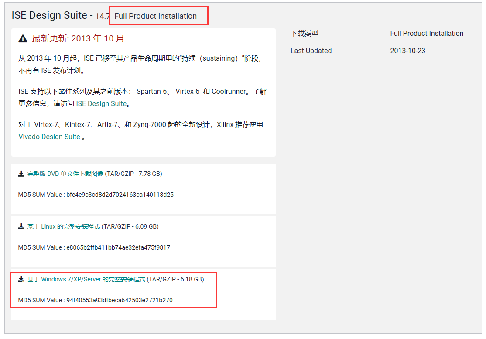

# ISE14.0 安装指南

> [!NOTE]
>
> 一些说明：
>
> 1. ISE 已经停止更新很久一段时间了，目前官方提供的安装包只能在 Win10，Win7，Linux 上面跑。
> 2. 但是！虽然可以在 Win10 上面安装，但是的但是，你去官网下载的时候会发现：Win10 的安装包体积明显比 Win7 和 Linux 大，这是为什么？我解释一下 ISE 在 Win10 里面跑起来的原理哈。首先各位电脑现在基本都是 Win11 系统，所以想要装 Win10 的 ISE 必须起虚拟机。然而，Win10 版 ISE 的原理是在你电脑里起一个 VirtualBox 虚拟机，然后装一个 Linux 系统，然后再装 ISE。听着分复杂对不对？但是这个过程安装程序帮你一步到位了。所以安装完成以后，你需要先启动 Win10 虚拟机，然后在虚拟机里启动 Linux 虚拟机，再启动 ISE。也就是宿主机套虚拟机再套虚拟机...当然，这可以成功运行啊。但是你不觉得很那个...那个...那个...那个...麻烦吗？
> 3. 所以以下这个安装指南我是用的 Win7 版本的。这样子只要起一个虚拟机就行了，并且我们的 Mulitsim 也可以在 Win7 上面跑。这些老软件确实是在老系统上跑的很稳定啊。

## 安装准备

1. 下载安装包

   [进入官方下载地址](https://china.xilinx.com/support/download/index.html/content/xilinx/zh/downloadNav/vivado-design-tools/archive-ise.html) 选择第二个 14.7

   

   然后往下划，基本要往下翻一页，选择“基于 Windows 7/XP/Server 的完整安装程式 (TAR/GZIP - 6.18 GB)”，下载完整版压缩包（一定要下载完整版！）

   

   下载完成之后你会得到一个 .tar 后缀的压缩包。

   提示：下载前会让你注册账号。

2. 下载 VirtualBox 或者 VMware 虚拟机（VMware 需要去找破解版，网上很多）。这一步不做详细教程，上网搜，资源很多。
3. 下载 Windows7 x86 系统镜像（注意此处要下载 x86 镜像，也就是 32 位系统）。你可以从南邮正版软件下载处得到这个镜像（智慧校园，左边下面，正版软件）
   

4. 挂载镜像，启动 Win7 虚拟机（注意：因为是 32 位镜像，所以分配内存不能大于 4GB）
5. 安装 Win7 的一个升级补丁（原因：由于微软更新了驱动程序签名算法，2019 年开始弃用 SHA1，改用 SHA2。猜测目前这两个虚拟机驱动程序都使用 SHA2，而 Windows7 只支持 SHA1，需要下载安装补丁 kb4474419 来支持 SHA2 算法。）

   [点击进入下载地址](https://www.catalog.update.microsoft.com/Search.aspx?q=kb4474419)

   然后下载最后一个

   

6. 将下载的补丁文件复制到虚拟机中，然后双击运行。这一步看起来很简单是吧？其实不容易。在没安装这个补丁之前虚拟机和宿主机无法直接通信来传递文件。所以两种方法：1.通过共享文件夹复制 2.直接在虚拟机下载补丁（但可能会有无法联网的情况）
7. 上面第一步我们下载得到了一个后缀位 tar 的安装包。请！使用！7-zip！或者！Bandizip！或者其他解压软件解压这个压缩包（总之不要用系统自带的解压就行）。然后，运行里面的 exe 安装程序，一步一步安装。
8. 最后安装完成后，选择许可文件 licence 即可完成安装。

## 个人安装经历

1. 首先在 VMware 中安装一个 windows7 虚拟机
2. 安装完成后进入虚拟机，还需安装更新补丁 windows6.1-kb4474419-v3-x86
3. 解压缩 Xilinx_ISE_DS_Win_14.7_1015_1.tar，按照其他教程的步骤安装，以相同步骤正常导入 license12x.lic 许可证
